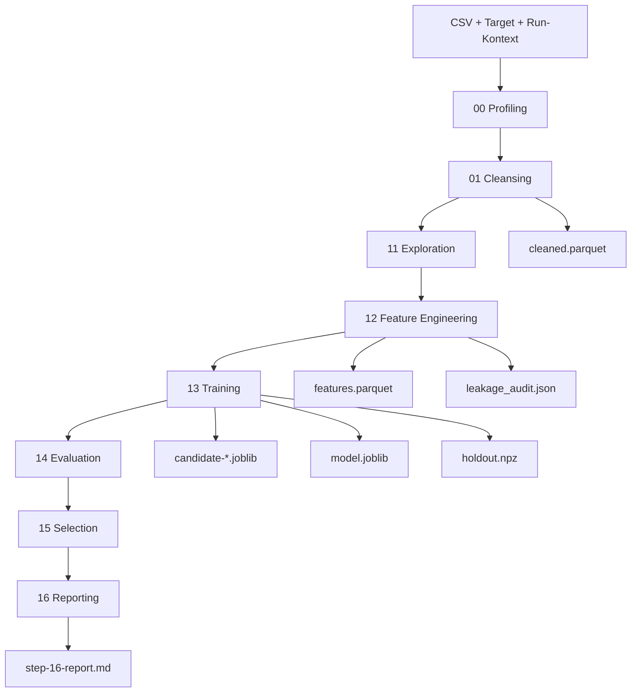
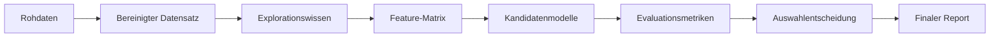

# Data Forecast Generator

Systemueberblick und aktuelle Arbeitsweise des vorhandenen Forecasting-Systems.

## 1. Projektueberblick

Der Data Forecast Generator fuehrt eine CSV-Datei durch einen agentischen, mehrstufigen Forecasting- bzw. Regressionsworkflow. Aus Rohdaten, Zielspalte und Laufparametern entstehen bereinigte Daten, Features, trainierte Modellkandidaten, eine Modellentscheidung und ein Markdown-Report.

Der aktuelle lauffaehige Systemkern besteht aus eigenstaendigen Python-Step-Skripten, die pro Run unter `OUTPUT_DIR/code` liegen. Jeder Schritt liest seine Eingaben aus dem Run-Verzeichnis, schreibt seine Artefakte zurueck nach `OUTPUT_DIR` und aktualisiert `progress.json`.

### Grundinput

- CSV-Datei, z. B. `data/appliances_energy_prediction.csv`
- Zielspalte, z. B. `appliances`
- Run-ID
- Output-Verzeichnis, z. B. `output/singleagent_20260424T073352Z`
- Split-Modus: `auto`, `random` oder `time_series`

### Zentrale Outputs

- `progress.json`
- `step-00_profiler.json`
- `step-00_data_profile_report.md`
- `cleaned.parquet`
- `step-01-cleanse.json`
- `step-11-exploration.json`
- `features.parquet`
- `step-12-features.json`
- `leakage_audit.json`
- `candidate-*.joblib`
- `model.joblib`
- `holdout.npz`
- `step-13-training.json`
- `step-14-evaluation.json`
- `step-15-selection.json`
- `step-16-report.md`
- `code_audit.json`

## 2. Laufmodell

Ein Run ist ein in sich geschlossenes Artefaktverzeichnis:

```text
output/<RUN_ID>/
├── code/
│   ├── runtime_utils.py
│   ├── step_00_pre_exploration.py
│   ├── step_01_cleanse.py
│   ├── step_11_exploration.py
│   ├── step_12_features.py
│   ├── step_13_training.py
│   ├── step_14_evaluation.py
│   ├── step_15_selection.py
│   ├── step_16_report.py
│   └── orchestrator.py
├── progress.json
├── cleaned.parquet
├── features.parquet
├── holdout.npz
├── model.joblib
├── candidate-*.joblib
├── step-*.json
└── step-16-report.md
```

Die Step-Skripte sind einzeln ausfuehrbar. Der Orchestrator ist nur eine duenne Ausfuehrungsschicht, die die Schritte in Reihenfolge startet und den gemeinsamen Run-Kontext uebergibt.

### Ausfuehrungsreihenfolge

1. `00-pre-exploration`
2. `01-csv-read-cleansing`
3. `11-data-exploration`
4. `12-feature-extraction`
5. `13-model-training`
6. `14-model-evaluation`
7. `15-model-selection`
8. `16-result-presentation`

## 3. End-to-End-Ablauf

### 3.1 Profiling

Step 00 liest die CSV leichtgewichtig ein und erstellt eine erste Strukturaufnahme. Dazu gehoeren Header, Beispielzeilen, grobe Typinformationen, Zeilenanzahl und Auffaelligkeiten.

Outputs:

- `step-00_profiler.json`
- `step-00_data_profile_report.md`

### 3.2 Cleansing

Step 01 liest die CSV mit Polars, normalisiert Spaltennamen, validiert die Zielspalte, erkennt nach Moeglichkeit eine Zeitspalte und schreibt den bereinigten Datensatz als Parquet.

Outputs:

- `cleaned.parquet`
- `step-01-cleanse.json`

Wichtige Felder:

- `target_column_normalized`
- `row_count_after`
- `null_rate`
- `artifacts.cleaned_parquet`
- erkannte Zeitspalte, falls vorhanden

### 3.3 Exploration

Step 11 analysiert den bereinigten Datensatz auf Feature-Qualitaet, Redundanz, Informationsgehalt und Zeitreihensignale.

Was berechnet wird:

- numerische Spalten
- Near-Zero-Variance
- Mutual Information gegen das Target
- MI-Rauschbaseline mit Zufallsfeatures
- redundante Features ueber Korrelation
- Leakage-Risiken
- signifikante Target-Lags
- nuetzliche Feature-Lags
- empfohlene Features fuer Step 12

Output:

- `step-11-exploration.json`

Wichtige Felder:

- `numeric_columns`
- `mi_ranking`
- `noise_mi_baseline`
- `recommended_features`
- `excluded_features`
- `significant_lags`
- `useful_lag_features`
- `target_candidates`

### 3.4 Feature Engineering

Step 12 baut aus den empfohlenen Features eine trainierbare Feature-Matrix. Der Schritt verwendet die Empfehlungen aus Step 11 als Startpunkt und erzeugt zusaetzliche Zeit-, Lag- und Rolling-Features, soweit diese aus den Explorationssignalen begruendet sind.

Leakage-Pruefungen laufen in diesem Schritt mit. Ein Lauf mit fehlgeschlagener Leakage-Pruefung darf nicht als erfolgreich gelten.

Outputs:

- `features.parquet`
- `step-12-features.json`
- `leakage_audit.json`

Wichtige Felder:

- `features`
- `features_excluded`
- `created_features`
- `split_strategy.resolved_mode`
- `artifacts.features_parquet`
- `leakage_audit.status`

### 3.5 Training

Step 13 rekonstruiert Feature-Liste und Target aus den Step-12-Artefakten, splittet die Daten und trainiert mehrere Regressionskandidaten.

Aktuelle Kandidaten:

- `ridge`
- `random_forest`
- `gradient_boosting`
- optional `xgboost`, wenn installiert

Der Split wird bei `split-mode=auto` aus dem Step-12-Kontext abgeleitet. Bei erkannter Zeitspalte wird chronologisch gesplittet, sonst zufaellig.

Outputs:

- `candidate-ridge.joblib`
- `candidate-random_forest.joblib`
- `candidate-gradient_boosting.joblib`
- optional weitere Kandidatenartefakte
- `model.joblib`
- `holdout.npz`
- `step-13-training.json`

Wichtige Felder:

- `split_mode`
- `feature_names`
- `candidates`
- `best_model_name`
- `artifacts.model_joblib`
- `artifacts.holdout_npz`

### 3.6 Evaluation

Step 14 laedt Holdout-Daten und Kandidatenmodelle, berechnet Modellmetriken und bewertet die Ergebnisqualitaet.

Berechnete Metriken:

- R2
- RMSE
- MAE
- Residual-Mean
- maximaler absoluter Residualfehler
- CV-Metriken aus Step 13
- naive Baseline
- MAPE, wenn sinnvoll berechenbar

Qualitaetswerte:

- `acceptable`
- `marginal`
- `subpar`
- `subpar_after_expansion`

Output:

- `step-14-evaluation.json`

Wichtige Felder:

- `target_stats`
- `candidates`
- `quality_assessment`
- `best_candidate`
- `leakage_probe`
- `expansion_diagnosis`
- `expansion_candidates`

### 3.7 Selection

Step 15 waehlt aus den evaluierten Kandidaten ein Modell aus. Die Auswahl basiert auf einem gewichteten Score aus R2, RMSE, MAE und Stabilitaet. Kandidaten mit negativem R2 gelten als nicht geeignet.

Der Schritt dokumentiert zudem die Baselines aus Step 14, analysiert kurz, warum Kandidaten gut oder schlecht funktionieren, und erzeugt einen technischen Markdown-Report mit Tabelle sowie einen einfachen Metrik-Plot.

Output:

- `step-15-selection.json`
- `step-15-model-selection-report.md`
- `step-15-model-selection-metrics.png`

Wichtige Felder:

- `selected_model`
- `weighted_score`
- `rationale`
- `baselines`
- `candidate_analysis`
- `quality_flag`
- `full_ranking`

### 3.8 Reporting

Step 16 erzeugt den finalen Markdown-Report und markiert den Run als abgeschlossen.

Output:

- `step-16-report.md`

Der Report enthaelt sechs Pflichtabschnitte:

1. Problem + selected target
2. Data quality summary
3. Candidate models + scores table
4. Selected model rationale
5. Risks and caveats
6. Next iteration recommendations

## 4. Visuelle Architekturuebersicht





## 5. Laufbefehle

### Neuer Run aus vorhandenem Step-Code

Ein neuer Run wird angelegt, indem die Step-Skripte in das neue Run-Verzeichnis kopiert und der Orchestrator dort gestartet wird.

```bash
RUN_ID="singleagent_$(date -u +%Y%m%dT%H%M%SZ)"
OUT="output/$RUN_ID"
mkdir -p "$OUT/code"
cp output/manual_run_001/code/*.py "$OUT/code/"

uv run python "$OUT/code/orchestrator.py" \
  --csv-path data/appliances_energy_prediction.csv \
  --target-column appliances \
  --output-dir "$OUT" \
  --run-id "$RUN_ID" \
  --split-mode auto
```

### Einzelnen Step erneut ausfuehren

Jeder Step ist separat startbar. Beispiel fuer Step 13:

```bash
uv run python output/<RUN_ID>/code/step_13_training.py \
  --output-dir output/<RUN_ID> \
  --run-id <RUN_ID> \
  --split-mode auto \
  --target-column appliances
```

### Modellartefakt laden

```bash
uv run python - <<'PY'
import joblib
m = joblib.load("output/<RUN_ID>/model.joblib")
print(type(m))
print(hasattr(m, "predict"))
PY
```

### Nachgelagerte Inferenz

```bash
uv run python scripts/infer_model.py \
  --run-dir output/<RUN_ID> \
  --csv data/appliances_energy_prediction.csv \
  --target-column appliances
```

### Nachgelagerte Visualisierung

```bash
uv run python scripts/plot_split_timeseries.py \
  --run-dir output/<RUN_ID>
```

## 6. Laufzeitumgebung

Die Ausfuehrung erfolgt ueber `uv`.

Vorbereitung:

```bash
uv sync --extra dev
uv pip install -e ".[dev]"
uv pip install pandas statsmodels scipy pyarrow
```

Im zuletzt verifizierten Lauf waren diese Pakete vorhanden:

- `joblib`
- `pandas`
- `polars`
- `pyarrow`
- `scikit-learn`
- `scipy`
- `statsmodels`

## 7. Validierungsgates

Ein Run gilt als erfolgreich, wenn die Step-Artefakte vorhanden sind, die erwarteten JSON-Felder gesetzt sind, Modellartefakte ladbar sind und `progress.json` am Ende `status=completed` enthaelt.

### Wichtige Gates

- Step 01:
  - `row_count_after > 0`
  - `target_column_normalized` gesetzt
  - `cleaned.parquet` existiert
- Step 11:
  - `numeric_columns` nicht leer
  - `mi_ranking` nicht leer
  - `recommended_features` nicht leer
  - `noise_mi_baseline` ist endlich
- Step 12:
  - `features` nicht leer
  - `features.parquet` existiert
  - `leakage_audit.status = pass`
  - ausgeschlossene Features werden nicht wieder eingefuehrt
- Step 13:
  - `model.joblib` existiert und ist ladbar
  - `holdout.npz` existiert
  - mindestens ein Kandidat hat einen endlichen R2-Wert
- Step 14:
  - alle Kandidaten enthalten endliche `r2`, `rmse`, `mae`
  - `quality_assessment` ist gesetzt
  - `target_stats` ist gesetzt
- Step 15:
  - `quality_flag` ist gesetzt
  - `full_ranking` ist vorhanden
  - bei viablem Ergebnis ist `selected_model` gesetzt
- Step 16:
  - `step-16-report.md` existiert
  - Report ist mindestens 500 Bytes gross
  - alle sechs Pflichtabschnitte sind enthalten
  - `progress.json.status = completed`

## 8. Zuletzt verifizierter End-to-End-Run

Der zuletzt verifizierte vollstaendige Run liegt unter:

```text
output/singleagent_20260424T073352Z
```

Input:

- CSV: `data/appliances_energy_prediction.csv`
- Target: `appliances`
- Split-Modus: `auto`

Ergebnis:

- `progress.json`: `status = completed`
- abgeschlossene Steps: 8 von 8
- Validierung: 38 von 38 Checks bestanden
- `leakage_audit.json`: `status = pass`
- `model.joblib`: per `joblib.load(...)` ladbar
- finaler Report: `step-16-report.md`

Modellauswahl:

- ausgewaehltes Modell: `ridge`
- Qualitaetsflag: `acceptable`
- R2: `0.5668829594991238`
- RMSE: `59.56329686814976`
- MAE: `28.412928284580204`

Ranking:

1. `ridge`
2. `gradient_boosting`
3. `random_forest`

## 9. Komponentenuebersicht

### `runtime_utils.py`

Gemeinsame Hilfsfunktionen fuer:

- JSON lesen/schreiben
- Verzeichnisse anlegen
- `progress.json` initialisieren und aktualisieren
- Step-Status setzen
- Code-Audit schreiben
- Dateihashes berechnen

### `orchestrator.py`

Duenner Runner fuer die komplette Step-Reihenfolge. Er setzt den gemeinsamen Laufkontext und startet die Step-Skripte nacheinander.

### Step-Skripte

Die Step-Skripte enthalten die eigentliche Pipeline-Logik. Sie sind eigenstaendige CLI-Programme und koennen einzeln erneut gestartet werden.

### `scripts/infer_model.py`

Nachgelagertes Utility fuer Vorhersagen auf Basis eines vorhandenen Run-Verzeichnisses.

### `scripts/plot_split_timeseries.py`

Nachgelagertes Utility fuer Visualisierungen von Split und Vorhersagequalitaet.

## 10. Bekannte technische Hinweise

- Step 11 benoetigt fuer `polars.to_pandas()` eine Umgebung mit `pyarrow`.
- Step 12 erzeugt fuer Rolling-Fenster der Groesse 1 keine `rolling_std`-Spalte, weil diese sonst vollstaendig leer waere und die Feature-Matrix leeren kann.
- Step 13 serialisiert Modellparameter JSON-sicher, da manche `get_params()`-Werte Objekte enthalten.
- Step 13 verwendet reduzierte Kandidaten- und CV-Konfigurationen, damit der Lauf praktikabel bleibt.
- Waehrend Korrelationen und Modellvorhersagen koennen Warnungen von NumPy oder scikit-learn auftreten; sie sind im verifizierten Lauf nicht blockierend gewesen.

## Schlussbild

Der aktuelle Ist-Zustand ist ein lauffaehiger, run-basierter Forecasting-Workflow. Der stabile Arbeitsmodus besteht darin, fuer jeden Lauf ein eigenes `OUTPUT_DIR` mit `code/` und Artefakten zu erzeugen, die Step-Skripte dort auszufuehren und nach jedem Schritt die Output-Gates zu pruefen. Der zuletzt verifizierte Run zeigt den kompletten Ablauf von CSV-Profiling bis Report und Modellartefakt erfolgreich.
