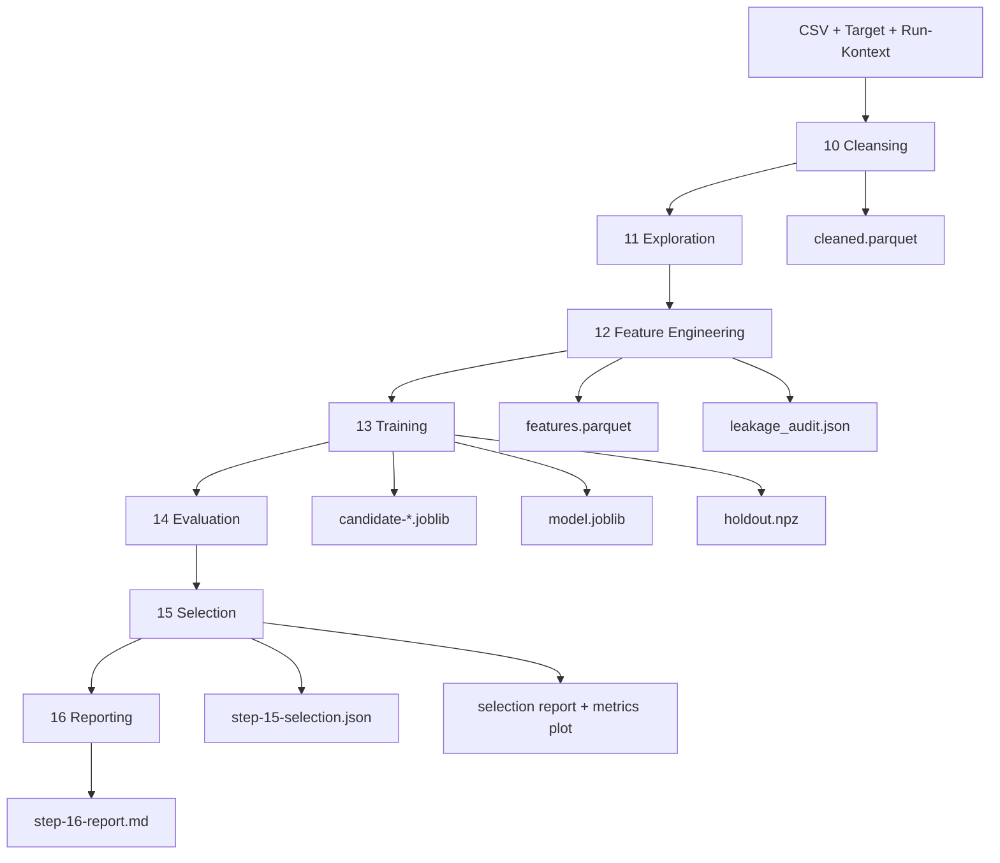
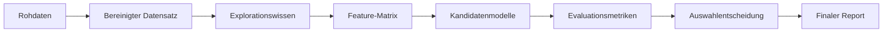

# Data Forecast Generator

Systemueberblick und aktuelle Arbeitsweise des vorhandenen Forecasting-Systems.

## 1. Projektueberblick

Der Data Forecast Generator fuehrt eine CSV-Datei durch einen agentischen, mehrstufigen Forecasting- bzw. Regressionsworkflow. Aus Rohdaten, Zielspalte und Laufparametern entstehen bereinigte Daten, Features, trainierte Modellkandidaten, eine Modellentscheidung und ein Markdown-Report.

Der Systemkern besteht aus eigenstaendigen Python-Step-Skripten, die pro Run unter `OUTPUT_DIR/code` liegen. Jeder Schritt liest seine Eingaben aus dem Run-Verzeichnis, schreibt seine Artefakte zurueck nach `OUTPUT_DIR` und aktualisiert `progress.json`.

### Grundinput

- CSV-Datei, z. B. `data/appliances_energy_prediction.csv`
- Zielspalte, z. B. `appliances`
- Run-ID
- Output-Verzeichnis, z. B. `output/singleagent_20260424T073352Z`
- Split-Modus: `auto`, `random` oder `time_series`

### Zentrale Outputs

- `progress.json`
- `cleaned.parquet`
- `step-10-cleanse.json`
- `step-11-exploration.json`
- `features.parquet`
- `step-12-features.json`
- `leakage_audit.json`
- `candidate-*.joblib`
- `model.joblib`
- `holdout.npz`
- `step-13-training.json`
- `step-14-evaluation.json`
- `step-15-selection.json`
- `step-15-model-selection-report.md`
- `step-15-model-selection-metrics.png`
- `step-16-report.md`
- `code_audit.json`

## 2. Laufmodell

Ein Run ist ein in sich geschlossenes Artefaktverzeichnis:

```text
output/<RUN_ID>/
├── code/
│   ├── runtime_utils.py
│   ├── step_10_cleanse.py
│   ├── step_11_exploration.py
│   ├── step_12_features.py
│   ├── step_13_training.py
│   ├── step_14_evaluation.py
│   ├── step_15_selection.py
│   ├── step_16_report.py
│   └── orchestrator.py
├── progress.json
├── cleaned.parquet
├── features.parquet
├── holdout.npz
├── model.joblib
├── candidate-*.joblib
├── step-*.json
├── step-15-model-selection-report.md
├── step-15-model-selection-metrics.png
└── step-16-report.md
```

Die Step-Skripte sind einzeln ausfuehrbar. Der Orchestrator ist nur eine duenne Ausfuehrungsschicht, die die Schritte in Reihenfolge startet und den gemeinsamen Run-Kontext uebergibt.

### Ausfuehrungsreihenfolge

1. `10-csv-read-cleansing`
2. `11-data-exploration`
3. `12-feature-extraction`
4. `13-model-training`
5. `14-model-evaluation`
6. `15-model-selection`
7. `16-result-presentation`

## 3. End-to-End-Ablauf

### 3.1 Cleansing

Step 10 liest die CSV mit Polars, normalisiert Spaltennamen, validiert die Zielspalte, erkennt nach Moeglichkeit eine Zeitspalte und schreibt den bereinigten Datensatz als Parquet.

Outputs:

- `cleaned.parquet`
- `step-10-cleanse.json`

Wichtige Felder:

- `target_column_normalized`
- `row_count_after`
- `null_rate`
- `artifacts.cleaned_parquet`
- erkannte Zeitspalte, falls vorhanden

### 3.2 Exploration

Step 11 analysiert den bereinigten Datensatz auf Feature-Qualitaet, Redundanz, Informationsgehalt und Zeitreihensignale.

Was berechnet wird:

- numerische Spalten
- Near-Zero-Variance
- Mutual Information gegen das Target
- MI-Rauschbaseline mit Zufallsfeatures
- redundante Features ueber Korrelation
- Leakage-Risiken
- signifikante Target-Lags
- nuetzliche Feature-Lags
- empfohlene Features fuer Step 12

Output:

- `step-11-exploration.json`

Wichtige Felder:

- `numeric_columns`
- `mi_ranking`
- `noise_mi_baseline`
- `recommended_features`
- `excluded_features`
- `significant_lags`
- `useful_lag_features`
- `target_candidates`

### 3.3 Feature Engineering

Step 12 baut aus den empfohlenen Features eine trainierbare Feature-Matrix. Der Schritt verwendet die Empfehlungen aus Step 11 als Startpunkt und erzeugt zusaetzliche Zeit-, Lag- und Rolling-Features, soweit diese aus den Explorationssignalen begruendet sind.

Leakage-Pruefungen laufen in diesem Schritt mit. Ein Lauf mit fehlgeschlagener Leakage-Pruefung darf nicht als erfolgreich gelten.

Outputs:

- `features.parquet`
- `step-12-features.json`
- `leakage_audit.json`

Wichtige Felder:

- `features`
- `features_excluded`
- `created_features`
- `split_strategy.resolved_mode`
- `artifacts.features_parquet`
- `leakage_audit.status`

### 3.4 Training

Step 13 rekonstruiert Feature-Liste und Target aus den Step-12-Artefakten, splittet die Daten und trainiert mehrere Regressionskandidaten.

Aktuelle Kandidaten:

- `ridge`
- `random_forest`
- `gradient_boosting`
- optional `xgboost`, wenn installiert

Der Split wird bei `split-mode=auto` aus dem Step-12-Kontext abgeleitet. Bei erkannter Zeitspalte wird chronologisch gesplittet, sonst zufaellig.

Outputs:

- `candidate-ridge.joblib`
- `candidate-random_forest.joblib`
- `candidate-gradient_boosting.joblib`
- optional weitere Kandidatenartefakte
- `model.joblib`
- `holdout.npz`
- `step-13-training.json`

Wichtige Felder:

- `split_mode`
- `feature_names`
- `candidates`
- `best_model_name`
- `artifacts.model_joblib`
- `artifacts.holdout_npz`

### 3.5 Evaluation

Step 14 laedt Holdout-Daten und Kandidatenmodelle, berechnet Modellmetriken und bewertet die Ergebnisqualitaet.

Berechnete Metriken:

- R2
- RMSE
- MAE
- Residual-Mean
- maximaler absoluter Residualfehler
- CV-Metriken aus Step 13
- naive Baseline
- MAPE, wenn sinnvoll berechenbar

Qualitaetswerte:

- `acceptable`
- `marginal`
- `subpar`
- `subpar_after_expansion`

Output:

- `step-14-evaluation.json`

Wichtige Felder:

- `target_stats`
- `candidates`
- `quality_assessment`
- `best_candidate`
- `leakage_probe`
- `expansion_diagnosis`
- `expansion_candidates`

### 3.6 Selection

Step 15 waehlt aus den evaluierten Kandidaten ein Modell aus. Die Auswahl basiert auf einem gewichteten Score aus R2, RMSE, MAE und Stabilitaet. Kandidaten mit negativem R2 gelten als nicht geeignet.

Output:

- `step-15-selection.json`
- `step-15-model-selection-report.md`
- `step-15-model-selection-metrics.png`

Wichtige Felder:

- `selected_model`
- `weighted_score`
- `rationale`
- `quality_flag`
- `full_ranking`

### 3.7 Reporting

Step 16 erzeugt den finalen Markdown-Report und markiert den Run als abgeschlossen.

Output:

- `step-16-report.md`

Der Report enthaelt sechs Pflichtabschnitte:

1. Problem + selected target
2. Data quality summary
3. Candidate models + scores table
4. Selected model rationale
5. Risks and caveats
6. Next iteration recommendations

## 4. Visuelle Architekturuebersicht





## 5. Demo- und Pruefbefehle

### Modellartefakt laden

```bash
uv run --no-sync python - <<'PY'
import joblib
m = joblib.load("output/manual_run_001/model.joblib")
print(type(m))
print(hasattr(m, "predict"))
PY
```

### Frontend starten

```bash
uv run streamlit run scripts/streamlit_single_agent_app.py
uv run streamlit run scripts/streamlit_inference_app.py
```

Die Training-/Analyse-App liegt in `scripts/streamlit_single_agent_app.py`. Die Inferenz- und Forecasting-App fuer vorhandene Run-Artefakte liegt in `scripts/streamlit_inference_app.py`. Streamlit gibt nach dem Start die lokale URL aus, typischerweise `http://localhost:8501`.

## 6. Laufzeitumgebung

Die Ausfuehrung erfolgt ueber `uv`.

Vorbereitung:

```bash
nix develop
uv sync --extra dev --no-install-project
```

Im zuletzt verifizierten Lauf waren diese Pakete vorhanden:

- `joblib`
- `pandas`
- `polars`
- `pyarrow`
- `scikit-learn`
- `scipy`
- `statsmodels`

## 7. Validierungsgates

Ein Run gilt als erfolgreich, wenn die Step-Artefakte vorhanden sind, die erwarteten JSON-Felder gesetzt sind, Modellartefakte ladbar sind und `progress.json` am Ende `status=completed` enthaelt.

### Wichtige Gates

- Step 10:
  - `row_count_after > 0`
  - `target_column_normalized` gesetzt
  - `cleaned.parquet` existiert
- Step 11:
  - `numeric_columns` nicht leer
  - `mi_ranking` nicht leer
  - `recommended_features` nicht leer
  - `noise_mi_baseline` ist endlich
- Step 12:
  - `features` nicht leer
  - `features.parquet` existiert
  - `leakage_audit.status = pass`
  - ausgeschlossene Features werden nicht wieder eingefuehrt
- Step 13:
  - `model.joblib` existiert und ist ladbar
  - `holdout.npz` existiert
  - mindestens ein Kandidat hat einen endlichen R2-Wert
- Step 14:
  - alle Kandidaten enthalten endliche `r2`, `rmse`, `mae`
  - `quality_assessment` ist gesetzt
  - `target_stats` ist gesetzt
- Step 15:
  - `quality_flag` ist gesetzt
  - `full_ranking` ist vorhanden
  - bei viablem Ergebnis ist `selected_model` gesetzt
- Step 16:
  - `step-16-report.md` existiert
  - Report ist mindestens 500 Bytes gross
  - alle sechs Pflichtabschnitte sind enthalten
  - `progress.json.status = completed`

## 8. Zuletzt verifizierter End-to-End-Run

Der zuletzt verifizierte vollstaendige Run liegt unter:

```text
output/singleagent_20260424T073352Z
```

Input:

- CSV: `data/appliances_energy_prediction.csv`
- Target: `appliances`
- Split-Modus: `auto`

Ergebnis:

- `progress.json`: `status = completed`
- abgeschlossene Steps: 7 von 7
- Validierung: 38 von 38 Checks bestanden
- `leakage_audit.json`: `status = pass`
- `model.joblib`: per `joblib.load(...)` ladbar
- finaler Report: `step-16-report.md`

Modellauswahl:

- ausgewaehltes Modell: `ridge`
- Qualitaetsflag: `acceptable`
- R2: `0.5668829594991238`
- RMSE: `59.56329686814976`
- MAE: `28.412928284580204`

Ranking:

1. `ridge`
2. `gradient_boosting`
3. `random_forest`

## 9. Komponentenuebersicht

### `runtime_utils.py`

Gemeinsame Hilfsfunktionen fuer:

- JSON lesen/schreiben
- Verzeichnisse anlegen
- `progress.json` initialisieren und aktualisieren
- Step-Status setzen
- Code-Audit schreiben
- Dateihashes berechnen

### `orchestrator.py`

Duenner Runner fuer die komplette Step-Reihenfolge. Er setzt den gemeinsamen Laufkontext und startet die Step-Skripte nacheinander.

### Step-Skripte

Die Step-Skripte enthalten die eigentliche Pipeline-Logik. Sie sind eigenstaendige CLI-Programme und koennen einzeln erneut gestartet werden.

### `scripts/streamlit_single_agent_app.py`

Streamlit-Frontend fuer Training und Analyse.

### `scripts/streamlit_inference_app.py`

Streamlit-Frontend fuer Inferenz und Forecasting auf vorhandenen Run-Artefakten.
